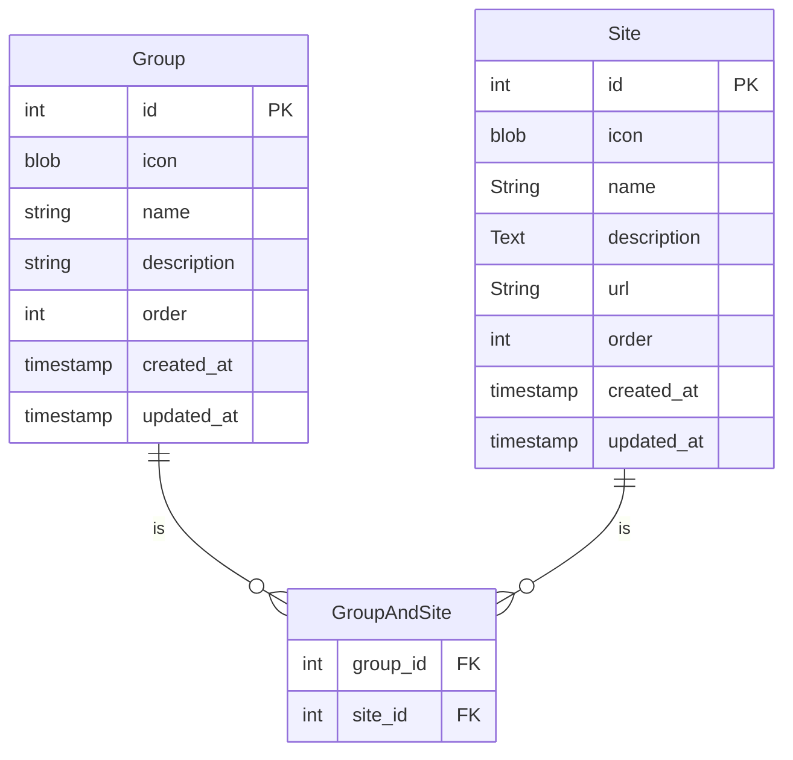

# Структура БД

```mermaid
erDiagram
    Group {
        int id PK
        blob icon
        string name
        string description
        int order
        timestamp created_at
        timestamp updated_at  
    }
    
    Site {
        int id PK
        blob icon
        String name
        Text description
        String url
        int order
        timestamp created_at
        timestamp updated_at  
    }
    
    GroupAndSite {
        int group_id FK
        int site_id FK
    }
    
    Group ||--o{ GroupAndSite: is
    Site ||--o{ GroupAndSite: is
    

```